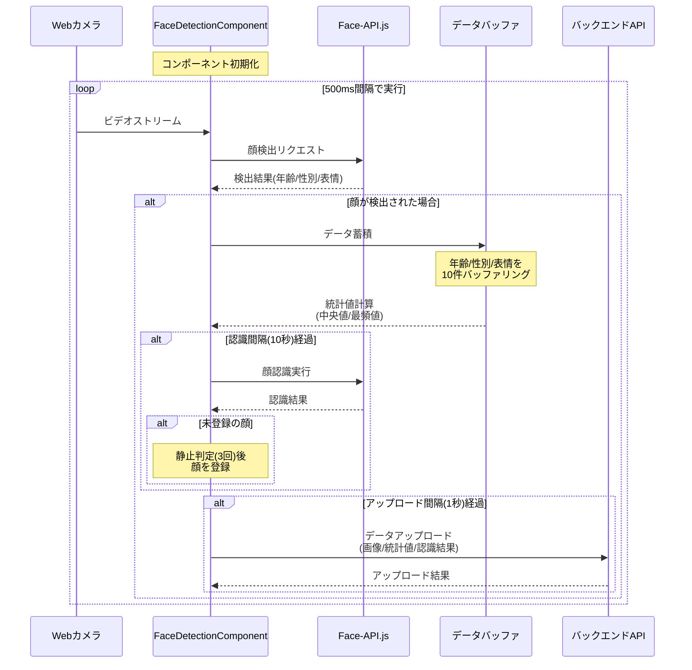

```mermaid
sequenceDiagram
    participant Video as Webカメラ
    participant Component as FaceDetectionComponent
    participant FaceAPI as Face-API.js
    participant Buffer as データバッファ
    participant Backend as バックエンドAPI

    Note over Component: コンポーネント初期化

    loop 500ms間隔で実行
        Video->>Component: ビデオストリーム
        Component->>FaceAPI: 顔検出リクエスト
        FaceAPI-->>Component: 検出結果(年齢/性別/表情)
        
        alt 顔が検出された場合
            Component->>Buffer: データ蓄積
            Note over Buffer: 年齢/性別/表情を<br/>10件バッファリング
            Buffer-->>Component: 統計値計算<br/>(中央値/最頻値)

            alt 認識間隔(10秒)経過
                Component->>FaceAPI: 顔認識実行
                FaceAPI-->>Component: 認識結果
                
                alt 未登録の顔
                    Note over Component: 静止判定(3回)後<br/>顔を登録
                end
            end

            alt アップロード間隔(1秒)経過
                Component->>Backend: データアップロード<br/>(画像/統計値/認識結果)
                Backend-->>Component: アップロード結果
            end
        end
    end
```